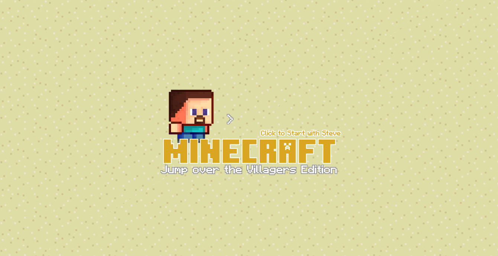
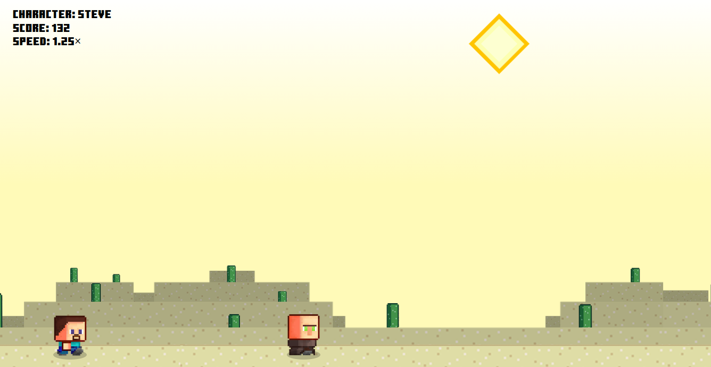
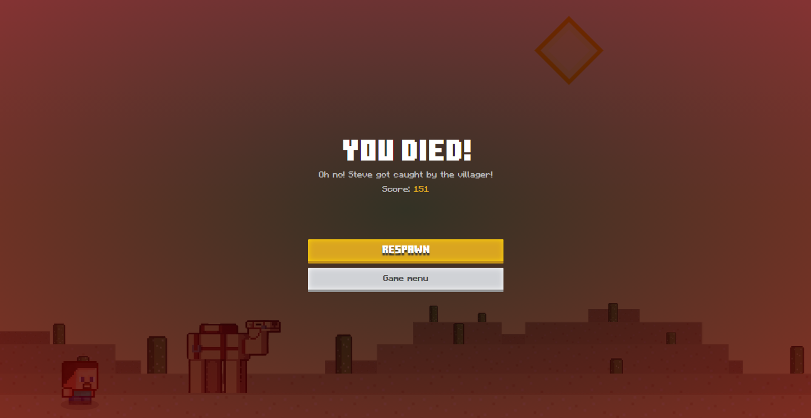

# Jump Over the Villagers

A lightweight browser game inspired by endless runners and Minecraft-style visuals. The player chooses a character skin, jumps over incoming villagers, and tries to survive as long as possible while the speed gradually increases.

## Project overview

This project is built with plain HTML, CSS, and JavaScript. It does not require a build step or package installation.

## Features

- Character selection screen with multiple skins
- Endless side-scrolling gameplay
- Space or Up Arrow jump controls
- Score and speed tracking
- Death/restart flow with sound effects and music
- Minecraft-inspired art and UI styling

## File structure

- `index.html` — main game page and UI structure
- `style.css` — game styling and layout
- `script.js` — gameplay logic, animation, keyboard controls, scoring
- `img/` — character and villager sprite assets
- `audios/` — background music and sound effects
- `fonts/` and `styles/` — font assets and font configuration

## How to run

### Option 1: Open on browser

[Click here to see demo](https://jump-over-villager.vercel.app/)

### Option 2: Open directly in browser

1. Open the project folder.
2. Double-click `index.html`.
3. The game should load in your default browser.

### Option 3: Run a local web server

From the project folder, run:

```bash
python -m http.server 8000
```

Then open:

```text
http://localhost:8000
```

## Screenshots





## Controls

- `Space` or `Up Arrow` — jump
- Click the title/start screen to begin the game
- Press the restart button after dying to continue

## Notes

- This game only playable in web desktop view.
- The project relies on local asset files, so it is best to run it from the project folder.
- Because it is a static front-end game, no installation or dependency setup is required.

## Credits

This project uses original web assets and custom CSS/JavaScript gameplay created for the game experience.

Created by: [upsetDokkaebi](https://github.com/upsetDokkaebi)
